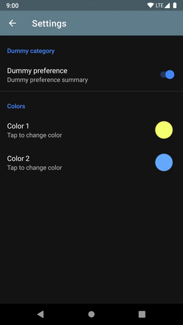
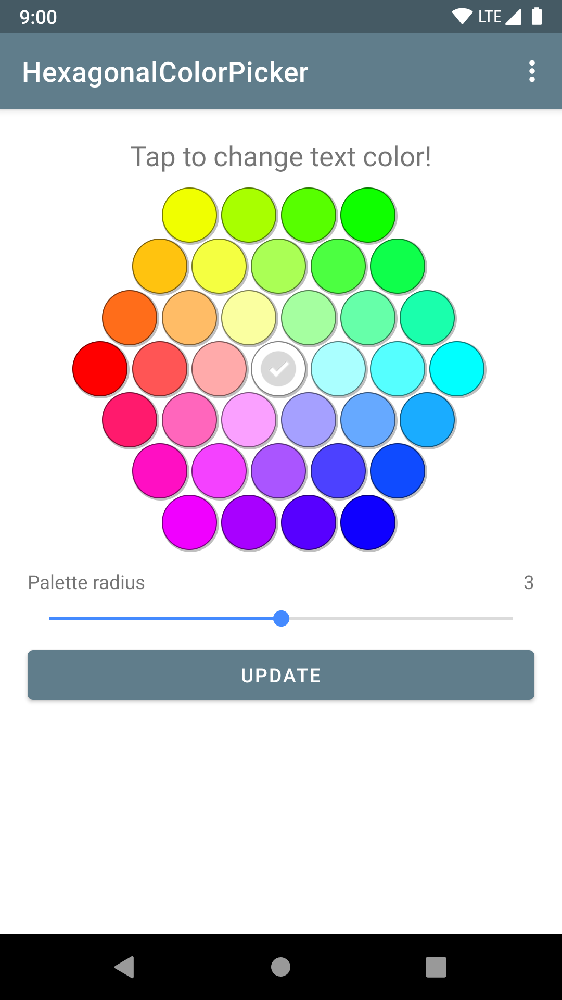
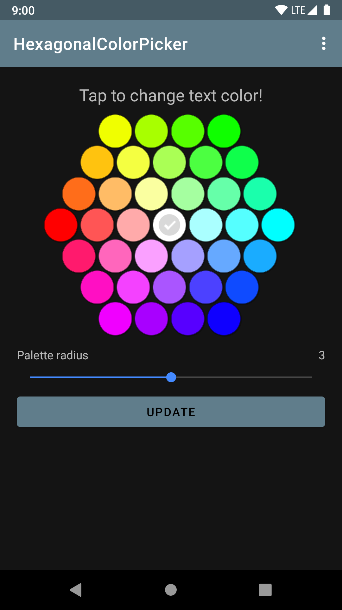
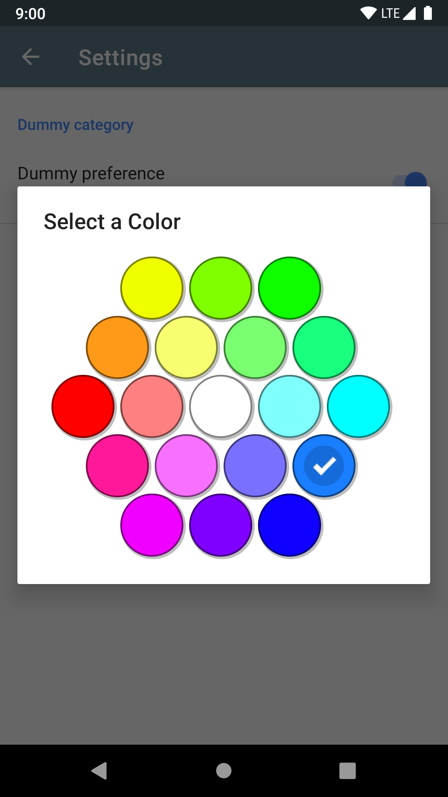
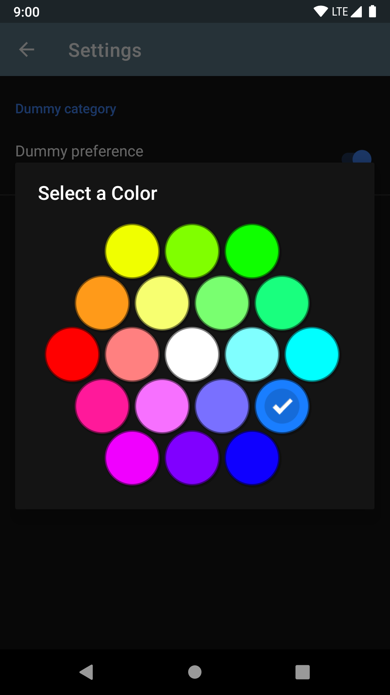
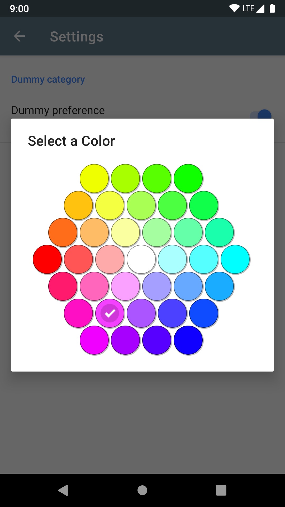
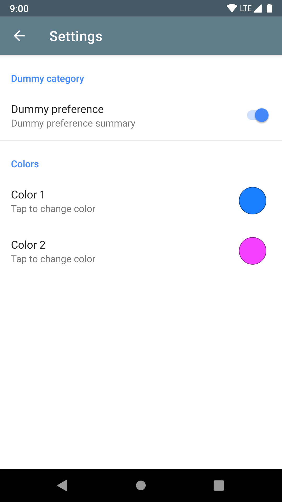
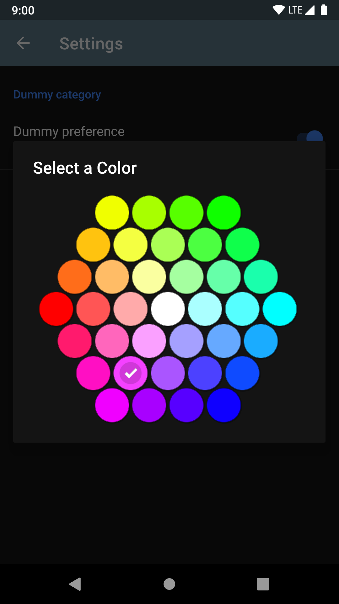
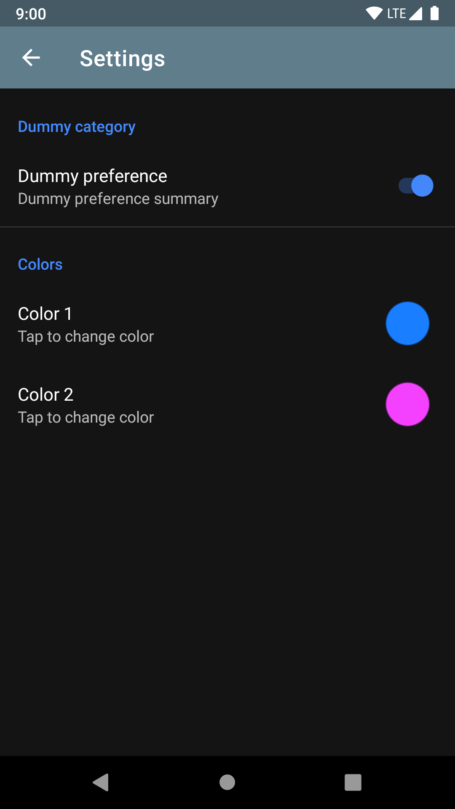

HexagonalColorPicker for Android
===================================

Simple color picker for Android with a hexagonal design.

The number of color swatches can be configured (parameter `"paletteRadius"`).

Can be used as custom:
- **View**
- **AlertDialog** (androidx.appcompat.app.AlertDialog)
- **Preference** (androidx.preference.Preference).



Setup
-----
Inside the ```app/build.gradle``` file add the following dependencies:
```
dependencies {
    implementation 'sk.hidasi:hexagonal-color-picker:1.2.0'
}
```

The library is hosted on JCenter:
```
repositories {
    jcenter()
}
```

View
----

Color Picker can be put in XML layout just like any other android view.

You can optionally define color change listener (see `HexagonalColorPicker#setListener`).

**Example:**

```xml
    <sk.hidasi.hexagonalcolorpicker.HexagonalColorPicker
        android:id="@+id/hexagonalColorPicker"
        android:layout_width="match_parent"
        android:layout_height="wrap_content"
        android:layout_gravity="center_horizontal"
        app:paletteRadius="3" />
```

**Screenshots:**




AlertDialog
-----------

The usage of AlertDialog class is really straightforward.

**Example:**

```java
    HexagonalColorPickerDialog dialog = new HexagonalColorPickerDialog(getContext(), R.string.color_picker_default_title, paletteRadius, initialColor, listener);
    dialog.show();
```

**Screenshots:**




Preference
----------

Color Picker can be used also on Preference Screen. Usage is the same as for any other preferences. You can provide default, initial color value by setting `android:defaultValue` attribute. Value selected in the dialog will be stored under the key provided with `android:key` attribute.

**Example:**

```xml
    <sk.hidasi.hexagonalcolorpicker.HexagonalColorPickerPreference
        android:key="key_color"
        android:title="@string/color"
        android:summary="@string/tap_to_change_color"
        android:defaultValue="@color/red"
        app:paletteRadius="3" />
```

**Screenshots:**







HexagonalColorPickerExample
---------------------------

Provided example application demonstrates the usage of HexagonalColorPicker.

You can install the application from Google Play for easy access:

[](https://play.google.com/store/apps/details?id=sk.hidasi.hexagonalcolorpickerexample)

License
-------

Code is licensed under the Apache License, Version 2.0.
